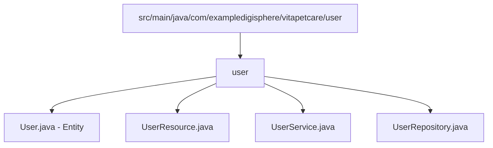

# Junie Girdleines for Spring Boot Development

## 1. Core Technologies & Version

### Backend

- **Language:** Java 21 (LTS)
- **Framework:** Spring Boot 3.x+
- **Persistence:** JPA / Hibernate (Default: Lazy Loading)
- **Database:** PostgreSQL (Driver & Dialect)
- **Migrations:** Liquibase
- **Security:** Spring Security (Method-Level Authority)

### Frontend

- **Framework:** Angular 20+
- **Language:** TypeScript
- **Features:** Standalone Components, Signals, Reactive Forms, Inject-based Dependency Injection.

---

## 2. Project Structure (Modular Architecture)

### Backend (Spring Boot)

Os arquivos são organizados por domínio (módulo). Todos os componentes de um domínio residem na mesma pasta.

## 3\. Architecture & Patterns

### 3.1 Layers and Responsibilities

* **Resource (Controller)**

* REST entrypoint

* Handles `Optional` returned by Service

* **Service**

* Business logic layer

* Converts DTO → Domain

* Uses Streams and Optional chaining

* Returns `Optional<Output>`

* **Repository**

* Pure JPA persistence interface

* No business logic

* **Mapper**

* Mandatory conversion contract

* Isolates transformations between layers

### 3.2 Contracts and Typing

* **API:** Always RESTful, returning JSON

* **Endpoints:** Always plural (`/users`, `/products`)

* **DTOs:** Use Java `record` exclusively

* **Mapping Contract:**

`public interface Mapper<I, D, O> {     D toDomain(I input);     O toOutput(D domain); }`

* * *

## 4\. Functional Programming & Coding Standards

### 4.1 Code Style

* **Abstraction > Repetition**

* Avoid boilerplate

* Avoid unnecessary classes

* **Immutability**

* No manual constructors

* **Functional Logic**

* Mandatory use of Streams

* Mandatory use of Optional chaining

* Side effects only via `OptionalUtils.peek`

### 4.2 Standard Implementation Example

`@Transactional 
 @Info(
    dev = Dev.heltonOliveira, 
    label = Label.doc, 
    date = "20/09/2025", 
    description = "Salva usuário e processa arquivos de avatar de forma funcional" ) 
 public Optional<UserOutput> save(@NonNull UserInput input) {     
    log.info("Iniciando criação de usuário para o input: {}", input);      
    final List<FileInput> editedFiles = Optional.ofNullable(input.avatar())             
          .filter(FileInput::edited)
          .map(List::of)
          .orElseGet(List::of);      
   return Optional.of(userRepository.save(userMapper.toDomain(input)))
          .map(peek(ignore -> fileService.saveAllAndFlush(input, editedFiles)))             
          .map(peek(user -> user.set_token(jwtUtil.generateToken(user.getUsername(), List.of(user.getRole())))))             
          .map(userMapper::toOutput); 
 }`

* * *

## 5\. Persistence & Database

### 5.1 Entity Rules

* **BaseEntity**

* All domain entities must extend `BaseEntity`

* **Relationships**

* Child entity always holds the Foreign Key

* Parent entity keeps the reference (`@OneToMany` / `@OneToOne`)

* All relationships use `FetchType.LAZY`

### 5.2 Explicit Relationship Initialization

`public User loadFiles() {     Hibernate.initialize(files);     return this; }`

* * *

## 6\. Security & Permissions

* Access control is **exclusively method-level**

* Enforced via `@PreAuthorize`

### 6.1 PermissionModel Hierarchy

* **Admin**

* `hasRole('ROLE_ADMIN')`

* Full access to the resource

* **Granular Permissions**

* Resource-based authorities:

* `USER_VIEW`

* `USER_CREATE`

* `USER_EDIT`

* `USER_DELETE`

* * *

## 7\. Documentation & Logging

### 7.1 @Info Annotation

* Mandatory on **all public classes and methods**

* Required fields:

* **dev:** Developer name

* **label:** Task type (`doc`, `feature`, `fix`)

* **description:** Clear responsibility description

### 7.2 Professional Logging

* Services must log received input data

* Logs must:

* Be clear

* Be objective

* Track functional transformation flow
